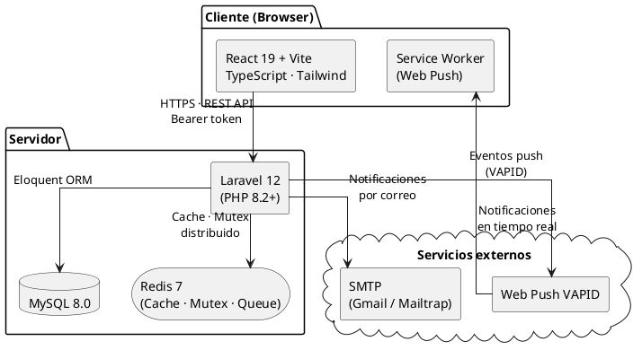
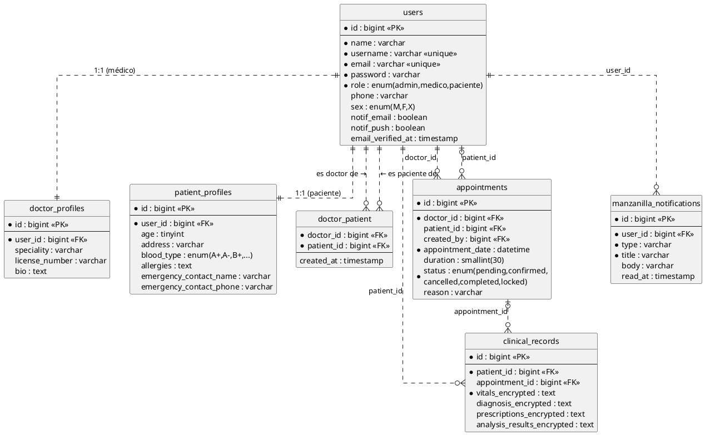
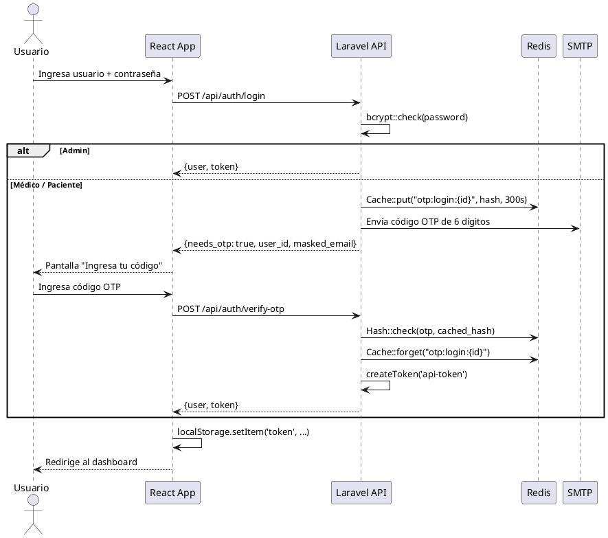
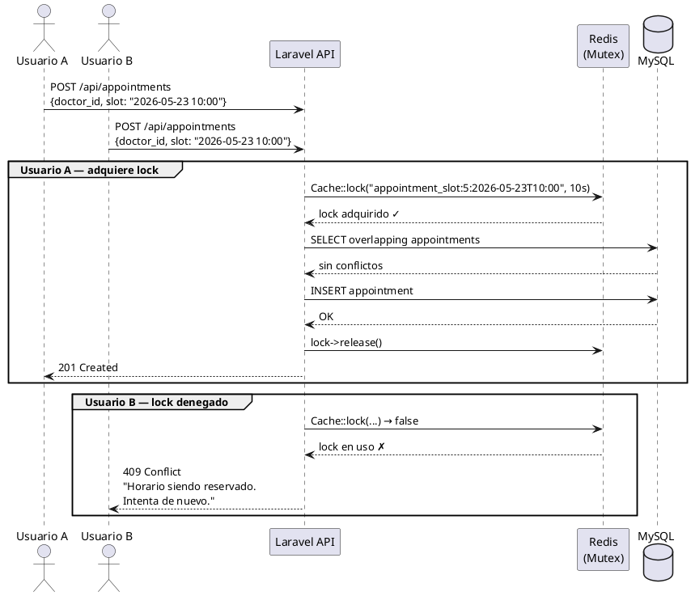

# Consultorio Manzanilla — Sistema Distribuido de Citas Médicas

Sistema web distribuido para la gestión de citas médicas, historiales clínicos y notificaciones. Desarrollado con React + Laravel + MySQL + Redis.

## Estructura

```
CitasMedicas/
├── frontend/   React 18 + Vite + TypeScript + Tailwind
├── backend/    Laravel 11 + Sanctum + MySQL + Redis
└── SETUP.md    Guía de instalación detallada
```

---

## Instalación rápida

Consulta **[SETUP.md](./SETUP.md)** para la guía completa con todas las opciones de configuración (correo, push notifications, Redis, etc.).

### Pasos básicos

```bash
# 1. Backend
cd backend
composer install
cp .env.example .env
php artisan key:generate
# Edita .env con tus credenciales de MySQL, Redis y correo
php artisan db:create        # Crea la BD automáticamente
php artisan migrate          # Tablas + usuario admin
php artisan serve            # http://localhost:8000

# 2. Frontend
cd frontend
npm install
npm run dev                  # http://localhost:5173
```

### Credenciales iniciales

| Rol | Usuario | Contraseña |
|-----|---------|------------|
| Administrador | `admin` | `admin1234` |

El admin crea médicos y pacientes desde el panel. No hay datos de prueba precargados.

---

## Arquitectura

### Stack tecnológico

| Capa | Tecnología |
|------|------------|
| Frontend | React 19, Vite, TypeScript, Tailwind CSS |
| Backend | Laravel 12, PHP 8.2+ |
| Autenticación | Laravel Sanctum (tokens Bearer) |
| Base de datos | MySQL 8.0+ |
| Caché / Mutex | Redis 7+ |
| Correo | SMTP (Gmail / Mailtrap) |
| Push | Web Push API + VAPID + Service Worker |

### Roles

- **Admin** — gestiona médicos y pacientes, ve agenda global
- **Médico** — agenda citas, lleva historiales clínicos, ve su calendario
- **Paciente** — reserva citas, consulta su historial, recibe notificaciones

---

## Diagramas

> Los bloques `plantuml` se renderizan con el plugin de PlantUML para VS Code,  
> IntelliJ, o en [plantuml.com/plantuml](https://www.plantuml.com/plantuml).

### Diagrama de Componentes (Arquitectura)



---

### Diagrama Entidad-Relación



---

### Diagrama de Secuencia — Autenticación con OTP



---

### Diagrama de Secuencia — Reserva de Cita (Mutex Redis)



---

## Características principales

### Seguridad y autenticación
- Login con Sanctum Bearer tokens
- Contraseñas hasheadas con bcrypt
- Verificación de correo al registrarse (código de 6 dígitos, 24 h)
- Recuperación de contraseña por código OTP (15 min)
- Rutas protegidas por rol (`isAdmin`, `isDoctor`, `isPatient`)

### Historial clínico cifrado (AES-256)
Los campos sensibles (`vitals`, `diagnosis`, `prescriptions`, `analysis_results`) se almacenan cifrados en la BD usando `Crypt::encryptString` de Laravel (AES-256-CBC). Los accessors/mutators del modelo `ClinicalRecord` cifran al escribir y descifran al leer — los datos en texto plano nunca tocan la BD.

### Exclusión mutua distribuida (Redis)
El endpoint `POST /api/appointments` adquiere un **Redis lock** por slot de médico antes de verificar conflictos:

```php
$lock = Cache::lock("appointment_slot:{$doctorId}:{$slotKey}", 10);
if (!$lock->get()) abort(409, 'Horario siendo reservado. Intenta de nuevo.');

try {
    // Verifica solapamiento y crea la cita dentro del lock
} finally {
    $lock->release();
}
```

Si dos usuarios reservan el mismo horario al mismo tiempo, el segundo recibe HTTP 409 en lugar de crear una cita duplicada.

### Notificaciones
- **Correo** (SMTP): alta de cita, confirmación, reprogramación, cancelación, recordatorio
- **Web Push** (VAPID): mismos eventos en tiempo real vía Service Worker
- **Recordatorio automático**: push al iniciar sesión si hay cita hoy o mañana

### Calendario con duración de 30 min
Cada cita ocupa exactamente 30 minutos. El calendario del médico muestra slots de 30 min (8:00–18:30). Las citas completadas liberan su slot para futuros registros; los horarios pasados no se pueden reservar.

---

## API REST

Todas las rutas bajo `/api/` requieren `Authorization: Bearer {token}` (excepto auth).

| Ruta | Método | Descripción |
|------|--------|-------------|
| `/api/auth/login` | POST | Iniciar sesión |
| `/api/auth/register` | POST | Registro de paciente |
| `/api/auth/logout` | POST | Cerrar sesión |
| `/api/auth/me` | GET | Usuario autenticado |
| `/api/auth/forgot-password` | POST | Solicitar código OTP |
| `/api/auth/reset-password` | POST | Restablecer contraseña |
| `/api/patients` | GET / POST | Listar / crear pacientes |
| `/api/patients/{id}` | GET / PUT / DELETE | Gestión de paciente |
| `/api/appointments` | GET / POST | Listar / crear citas |
| `/api/appointments/{id}` | PUT / DELETE | Modificar / cancelar cita |
| `/api/appointments/{id}/remind` | POST | Enviar recordatorio manual |
| `/api/clinical-records` | GET / POST | Historial clínico |
| `/api/notifications` | GET | Notificaciones del usuario |
| `/api/push/subscribe` | POST | Suscribir a Web Push |
| `/api/reports/patients` | GET | Reporte lista de pacientes |
| `/api/reports/calendar` | GET | Reporte calendario de citas |
| `/api/reports/history/{id}` | GET | Reporte historial clínico |
| `/api/admin/doctors` | GET / POST | Gestión de médicos (admin) |
| `/api/admin/patients` | GET | Lista de pacientes (admin) |
